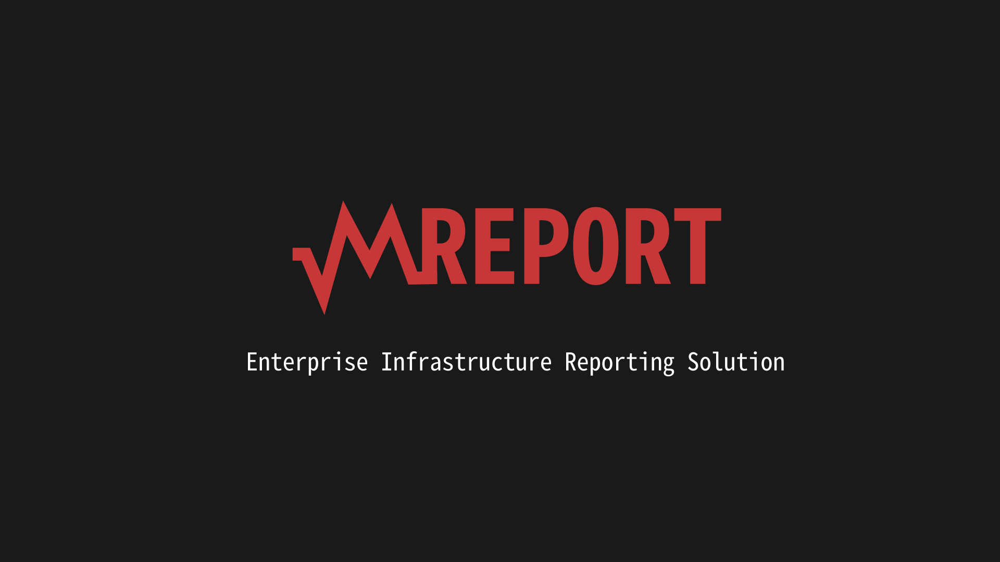

# Documentations

Welcome for use manual for MReport software. These pages are created to help the technicals successfully implement this tool in your environment Corporate, from the simple to the more complex.

## Summary

1. [Documentation of environments]()
   - 1.1. [Web Server]()
   - 1.2. [Zabbix Server]()
   - 1.3. [Database Server]()
   - 1.4. [MReport Server]()
   
2. [Configuration Documentation]()
   - 2.1. [Web Server]()
   - 2.2. [Zabbix Server]()
   - 2.3. [Database Server]()
   - 2.4. [MReport Server]()
   
3. [Tool Documentation]()
   - 3.1. [Custom Report]()
   - 3.2. [Automated email sending]()
   - 3.3. [Personalization of e-mail]()
   - 3.4. [High Availability]()
   
   ## Contact
   
   In case of an error, please contact us via e-mail `docreport@vaultcorp.com.br` and inform us. Or if you prefer, you can report through the same github.
