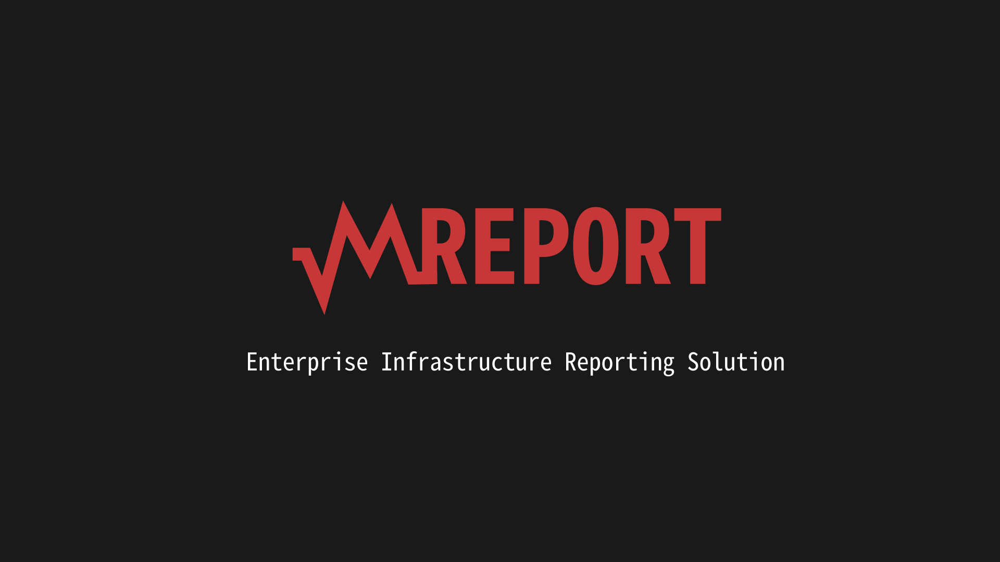

# About:

This tool was created to generate reports of your corporate environments, in a simple, effective and personalized way.

# High Availability:

Our system is made to handle a large amount of load and maintain a high system availability. Because reports of your environments and customers need to be available the whole time.

## Servers and Applications:

- Servers: Zabbix + Apache.
- Servers: Report + Apache.
- Servers: Database.

## Proxy Encrypted

The metrics collected by the Zabbix agent from your environment will be sent to a virtual machine that will contain an encrypted proxy, where a VPN will be established and sent to our Zabbix server. The metrics will be processed and generate a report as requested.

# Features:

- Custom Report.
- Automated email sending.
- Personalization of e-mail.
- Cost reduction with infrastructure.
- High Availability.

# Prince

The value is variable and relative to the stock exchange. However the values can be negotiated monthly and annually and be adjusted according to the contract. _This amount is paid per unit, ie per report issued._

$ Dolar | R$ Real | € Euro
--- | --- | ---
1,00 | 2,00 | 1,00

# Contact

If you want to contact us to negotiate values, close contract or even better understand how our tool works we are the arrangement.

E-mail: mreport@vaultcorp.com.br
Website: https://wwww.vaultcorp.com.br/mreport
Fanpage: https://wwww.facebook.com.br/VaultCorporation
